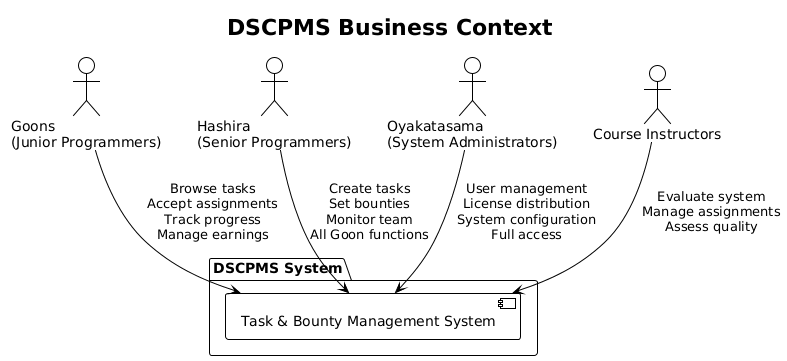
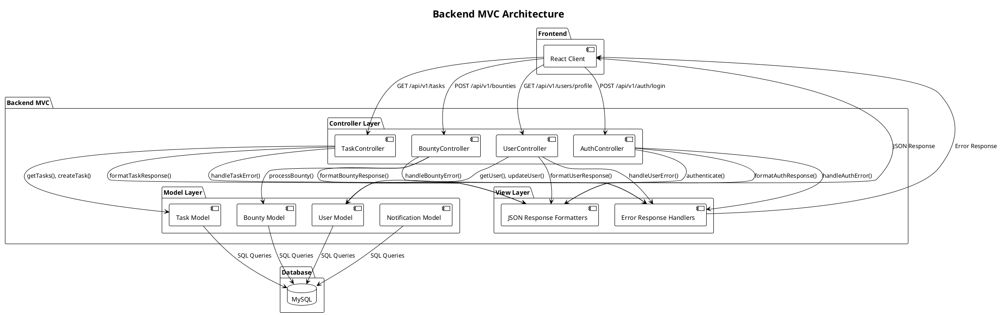

# Demon Slayer Corps Project Management System (DSCPMS) - Architecture and Design Document

## Table of Contents

1. [Introduction and Goals](#1-introduction-and-goals)
   - 1.1. [Requirements Overview](#11-requirements-overview)
   - 1.2. [Quality Goals](#12-quality-goals)
   - 1.3. [Stakeholders](#13-stakeholders)
2. [Architecture Constraints](#2-architecture-constraints)
   - 2.1. [Technical Constraints](#21-technical-constraints)
   - 2.2. [Organizational Constraints](#22-organizational-constraints)
   - 2.3. [Conventions](#23-conventions)
3. [System Scope and Context](#3-system-scope-and-context)
   - 3.1. [Business Context](#31-business-context)
   - 3.2. [Technical Context](#32-technical-context)
4. [Solution Strategy](#4-solution-strategy)
5. [Building Block View](#5-building-block-view)
   - 5.1. [Whitebox DSCPMS System](#51-whitebox-dscpms-system)
   - 5.2. [Building Blocks - Level 2](#52-building-blocks---level-2)
6. [Runtime View](#6-runtime-view)
   - 6.1. [User Authentication Flow](#61-user-authentication-flow)
   - 6.2. [Task Assignment and Completion](#62-task-assignment-and-completion)
   - 6.3. [Notification System Flow](#63-notification-system-flow)
7. [Deployment View](#7-deployment-view)
8. [Concepts](#8-concepts)
   - 8.1. [Domain Models](#81-domain-models)
   - 8.2. [Persistency](#82-persistency)
   - 8.3. [User Interface](#83-user-interface)
   - 8.4. [Security](#84-security)
   - 8.5. [Session Handling](#85-session-handling)
   - 8.6. [Error Handling](#86-error-handling)
   - 8.7. [Logging and Monitoring](#87-logging-and-monitoring)
   - 8.8. [Configuration](#88-configuration)
9. [Design Decisions](#9-design-decisions)
   - 9.1. [Technology Stack Selection](#91-technology-stack-selection)
   - 9.2. [Database Design](#92-database-design)
   - 9.3. [Authentication Strategy](#93-authentication-strategy)
10. [Quality Scenarios](#10-quality-scenarios)
11. [Technical Risks](#11-technical-risks)
12. [Glossary](#12-glossary)


## 1. Introduction and Goals

The Demon Slayer Corps Project Management System (DSCPMS) is a web-based application designed to revolutionize project management through gamification and role-based task assignment. The system addresses the need for better organization and resource allocation in software development projects by implementing a bounty-based reward system.

### 1.1. Requirements Overview

**What is DSCPMS?**

The main purpose of DSCPMS is to provide a gamified project management platform that combines traditional Kanban board functionality with monetary incentives through a bounty system. The application is designed specifically for software development teams looking to increase productivity and engagement through structured reward mechanisms.

**Main Features:**
- **Role-based User Management**: Three distinct user roles (Goons, Hashira, Oyakatasama) with escalating privileges
- **Bounty-based Task System**: Tasks with monetary rewards to incentivize completion
- **Kanban Board Interface**: Visual task management with drag-and-drop functionality
- **Real-time Notifications**: Instant updates on task assignments, completions, and deadlines
- **License Management**: Controlled access through license-based authorization
- **Analytics and Reporting**: Performance metrics and progress tracking
- **Deadline Management**: Automated penalty system for missed deadlines

The application supports exactly three user roles with specific hierarchical relationships:
- **Goons (Junior Programmers)**: Can select tasks, update status, and view personal profile
- **Hashira (Senior Programmers)**: All Goon capabilities plus task creation and team monitoring
- **Oyakatasama (Administrators)**: Full system administration including user and license management

The system should handle an "unlimited" number of tasks but is designed with a focus on quality over quantity, encouraging meaningful task completion through the bounty system.

### 1.2. Quality Goals

| Priority | Quality Goal | Description |
|----------|-------------|-------------|
| 1 | Usability | The interface should be intuitive with minimal learning curve, following modern web design patterns with clear visual feedback for all user actions |
| 2 | Security | Role-based access control and secure authentication to protect user data and system integrity |
| 3 | Performance | Fast response times (<500ms for API calls) and efficient handling of concurrent users (up to 50 simultaneous users) |
| 4 | Maintainability | Clean, modular architecture following React best practices with comprehensive documentation |
| 5 | Scalability | Architecture should support growth from current requirements (200 users, 1000 tasks) to potential larger deployments |

### 1.3. Stakeholders

The following table contains the most important personas for this application:

| Stakeholder | Interest/Role |
|-------------|---------------|
| **Students** | Primary developers learning modern web development with React, Node.js, and database design |
| **Junior Programmers (Goons)** | End users seeking task opportunities with monetary incentives and skill development |
| **Senior Programmers (Hashira)** | Team leads managing projects and creating task assignments with appropriate bounties |
| **Administrators (Oyakatasama)** | System administrators controlling access, licenses, and overall system configuration |
| **Course Instructors** | Evaluating project architecture, implementation quality, and adherence to requirements |
| **Project Stakeholders** | Interested in system adoption for real-world project management scenarios |

## 2. Architecture Constraints

The constraints on this project are reflected in the final solution. This section shows them and their motivation.

### 2.1. Technical Constraints

| ID | Constraint | Description |
|----|------------|-------------|
| **Software and Programming Constraints** |
| TC1 | Implementation in JavaScript/TypeScript | The application must use JavaScript/TypeScript for both frontend and backend to maintain consistency and leverage modern web development practices |
| TC2 | React Framework | Frontend must be built with React 18+ to meet modern component-based architecture requirements |
| TC3 | Node.js Backend | Backend implementation must use Node.js to enable full-stack JavaScript development |
| TC4 | Open Source Dependencies | All third-party libraries must be available under compatible open source licenses |
| **Database Constraints** |
| TC5 | MySQL Database | System must use MySQL 8.0+ for data persistence to meet course requirements |
| TC6 | Relational Data Model | Database design must follow normalized relational principles |
| **Deployment Constraints** |
| TC7 | Docker Containerization | Application must be containerized using Docker for consistent deployment |
| TC8 | Web-based Access | System must be accessible through standard web browsers without additional client software |

### 2.2. Organizational Constraints

| ID | Constraint | Description |
|----|------------|-------------|
| OC1 | Team | 3-4 student developers working collaboratively |
| OC2 | Time Schedule | One academic semester (approximately 12-16 weeks) development timeline |
| OC3 | Version Control | Git repository with collaborative branching strategy and comprehensive commit history |
| OC4 | Documentation | Complete technical documentation including API specifications and user guides |
| OC5 | Testing | Unit testing with minimum 70% coverage for critical business logic |
| OC6 | Code Quality | ESLint enforcement and consistent coding standards |

### 2.3. Conventions

| ID | Convention | Description |
|----|------------|-------------|
| C1 | Documentation | Structure based on arc42 template methodology |
| C2 | API Design | RESTful API following OpenAPI 3.0 specifications |
| C3 | Code Standards | JavaScript/TypeScript following Airbnb style guide with ESLint enforcement |
| C4 | Database Naming | Snake_case for database tables and columns, camelCase for application code |
| C5 | Component Structure | React functional components with hooks, organized by feature modules |

**Naming Conventions:**
- Database tables: `users`, `tasks`, `bounties`, `notifications`
- API endpoints: `/api/v1/resource-name` (kebab-case)
- React components: `PascalCase` (e.g., `TaskCard`, `UserProfile`)
- JavaScript variables and functions: `camelCase`

## 3. System Scope and Context

This chapter describes the environment and context of DSCPMS: who uses the system and on which other systems does DSCPMS depend.

### 3.1. Business Context



**Goons (Junior Programmers)**
Entry-level developers who use DSCPMS to find and complete programming tasks in exchange for monetary bounties. They interact with the system to browse available tasks, accept assignments, track progress, and manage their earnings.

**Hashira (Senior Programmers)**
Experienced developers who create and manage tasks, set bounty amounts, and monitor team progress. They have all the capabilities of Goons plus additional administrative functions for task and team management.

**Oyakatasama (System Administrators)**
System administrators responsible for user account management, license distribution, system configuration, and overall platform oversight. They have full access to all system functions.

**Course Instructors**
Academic stakeholders who evaluate the system's design, implementation quality, and educational value. They may also use the system for managing course-related programming assignments.

### 3.2. Technical Context


DSCPMS consists of three main technical components:

**Frontend (React Application)**
The client-side application runs in modern web browsers and communicates with the backend via REST API calls. Built with React 18+ and HeroUI components for a responsive, interactive user interface.

**Backend (Node.js Server)**
The server-side application provides RESTful API endpoints for all business logic, built with Express.js framework. Handles authentication, authorization, data validation, and business rule enforcement.

**Database (MySQL)**
Persistent data storage using MySQL 8.0+ with normalized relational schema for users, tasks, bounties, notifications, and audit logs.

| Interface | Protocol | Description |
|-----------|----------|-------------|
| Web UI | HTTPS | Browser-based user interface for all user interactions |
| API Communication | REST over HTTPS | JSON-based API for frontend-backend communication |
| Database Access | MySQL Protocol | Secure database connections with connection pooling |
| Development Tools | Docker | Containerized development and deployment environment |


## 4. Solution Strategy

At the core of DSCPMS is a role-based hierarchy that governs access to different system functions, combined with a bounty-based incentive system that gamifies task completion.

The application is built using a modern web development stack that emphasizes maintainability, scalability, and developer productivity:

**Frontend Strategy:** React 18+ with functional components and hooks provides a component-based architecture that is easy to understand, test, and extend. HeroUI component library ensures consistent design and reduces development time.

**Backend Strategy:** Node.js with Express.js following the MVC (Model-View-Controller) pattern provides a lightweight, fast server framework with clear separation of concerns. The MVC architecture ensures organized code structure with Models handling data logic, Controllers managing request/response flow, and Views (JSON responses) formatting output. RESTful API design enables potential future mobile applications.

**Data Strategy:** MySQL database with normalized schema design provides ACID compliance and reliable data persistence. Connection pooling and prepared statements ensure good performance and security.

**Security Strategy:** JWT-based authentication provides stateless, scalable session management. Role-based access control (RBAC) is implemented at both API and component levels to ensure proper authorization.

**Deployment Strategy:** Docker containerization provides consistent deployment environments and simplifies development setup. Docker Compose orchestrates multi-container deployment.

**Key Architectural Decisions:**

1. **Role-Based Architecture**: The three-tier user hierarchy (Goons → Hashira → Oyakatasama) is enforced throughout the system, from database constraints to UI component rendering.

2. **Bounty-First Design**: Tasks are always associated with monetary rewards, making the bounty system a core domain concept rather than an add-on feature.

3. **License-Controlled Access**: The system implements a license verification system that restricts functionality for unlicensed instances, adding a layer of access control.

4. **API-First Development**: The backend API is designed independently of the frontend, enabling potential future expansion to mobile or other client applications.

5. **Audit Trail**: All significant user actions are logged for compliance and debugging purposes.

## 5. Building Block View

The application is structured as a modern web application with clear separation between frontend presentation, backend business logic, and data persistence layers.

### 5.1. Whitebox DSCPMS System - Component Architecture


The system is decomposed into layered architecture with clear responsibilities:

**Client Layer (React Application)**
- **Intent/Responsibility**: User interface and user experience management
- **Interfaces**: 
  - HTTPS/WebSocket communication with backend
  - Component library integration (HeroUI)
  - State management for client-side data
- **Implementation**: React 18+ with functional components, HeroUI library, and modern JavaScript

**API Gateway Layer (Express.js Server)**
- **Intent/Responsibility**: Request routing, middleware processing, and API endpoint management
- **Interfaces**:
  - RESTful HTTP API endpoints
  - Database connections and queries
  - External service integrations
- **Implementation**: Node.js with Express.js framework, JWT authentication, input validation

**Database Layer (MySQL)**
- **Intent/Responsibility**: Data persistence, integrity, and retrieval
- **Interfaces**:
  - SQL queries from backend services
  - Database triggers and constraints
  - Backup and recovery operations
- **Implementation**: MySQL 8.0+ with normalized schema design

#### 5.1.1. Frontend Components (Blackbox)

**Intent/Responsibility**
The frontend provides an intuitive, responsive web interface for all user interactions with role-based component rendering and real-time updates.

**Interfaces**
- REST API consumption via HTTP/HTTPS
- Browser local storage for client-side state
- Real-time updates through API polling

**Files**
All frontend components are contained within the `frontend/src/` directory structure, organized by feature and component type.

#### 5.1.2. Backend Services (Blackbox)

**Intent/Responsibility**  
The backend implements all business logic, handles authentication and authorization, validates data, and manages external integrations.

**Interfaces**
- RESTful API endpoints (`/api/v1/*`)
- Database connection pooling
- JWT token management
- Input validation and sanitization

**Files**
Backend services are organized in the `backend/src/` directory with clear separation of concerns.

#### 5.1.3. Database Schema (Blackbox)

**Intent/Responsibility**
The database manages persistent data storage with referential integrity, constraints, and optimized query performance.

**Interfaces**
- MySQL connection protocol
- SQL query interface
- Backup and migration scripts

**Files**
Database schema definitions, migrations, and seed data are maintained in the `database/` directory.

### 5.2. Use Case View


### 5.3. Backend MVC Architecture

The backend follows the Model-View-Controller (MVC) pattern, providing clear separation of concerns:




**Model Layer**
- **Intent/Responsibility**: Data models, business entities, and database interactions
- **Components**: User, Task, Bounty, Notification, License entities with validation rules
- **Implementation**: Sequelize ORM models with MySQL database integration

**Controller Layer** 
- **Intent/Responsibility**: Handle HTTP requests, parameter extraction, and response coordination
- **Components**: AuthController, TaskController, UserController, BountyController
- **Implementation**: Express.js route handlers with middleware integration

**View Layer**
- **Intent/Responsibility**: Format and structure API responses 
- **Components**: JSON response formatters, error response handlers
- **Implementation**: Structured JSON responses with consistent error handling

**MVC Benefits:**
- Clear separation of business logic (Models) from request handling (Controllers)
- Consistent data formatting through Views
- Easy testing of individual components
- Scalable architecture for feature additions

### 5.4. Domain Model


## 6. Runtime View

User interaction with DSCPMS involves several key workflows that demonstrate the system's behavior during typical operations.

### 6.1. User Authentication Flow


### 6.2. Task Assignment and Completion


### 6.3. Notification System Flow


## 7. Deployment View


| Component | Technology | Description |
|-----------|------------|-------------|
| **Development Environment** | Node.js, Git, VSCode | Local development setup with hot reload and debugging |
| **Frontend Container** | React 18+, Vite, nginx | Production-optimized React build served by nginx |
| **Backend Container** | Node.js 18+, Express.js | API server with business logic and authentication |
| **Database Container** | MySQL 8.0+ | Persistent data storage with volume mounting |
| **Reverse Proxy** | nginx | Load balancing, SSL termination, and static file serving |

**Deployment Requirements:**
- Docker Engine 20.10+
- Docker Compose 2.0+
- Minimum 4GB RAM for all containers
- 20GB available disk space
- Network access for external API calls (if needed)

**Environment Configuration:**
- Development: Docker Compose with hot reload and debug ports exposed
- Production: Multi-stage Docker builds with optimized images and security hardening

---

## 8. Concepts

### 8.1. Domain Models

DSCPMS is built around a clear domain model that represents the core business entities and their relationships:


**Core Domain Entities:**

| Entity | Description | Key Attributes |
|--------|-------------|----------------|
| **User** | System users with role-based privileges | username, email, role (Goon/Hashira/Oyakatasama), balance |
| **Task** | Work items with bounty rewards | title, description, bountyAmount, deadline, status, priority |
| **Bounty** | Monetary rewards for task completion | amount, status (pending/paid/cancelled), paidAt |
| **License** | Access control for system usage | licenseKey, status, expiryDate |
| **Notification** | System-generated user notifications | type, message, readStatus, timestamp |
| **AuditLog** | System activity tracking | userId, action, entityType, timestamp |

**Important Business Methods:**

```typescript
class User {
  canCreateTask(): boolean
  canAssignTask(): boolean  
  hasValidLicense(): boolean
  calculateTotalEarnings(): number
}

class Task {
  isOverdue(): boolean
  canBeAssignedTo(user: User): boolean
  calculatePenalty(): number
  getTimeRemaining(): Duration
}

class Bounty {
  process(): void
  calculateBonus(): number
  canBePaid(): boolean
}
```

### 8.2. Persistency

DSCPMS uses MySQL 8.0+ for relational data storage with a normalized database schema designed for data integrity and query performance.

**Database Schema Design:**
```sql
-- Core Tables
CREATE TABLE users (
  id INT PRIMARY KEY AUTO_INCREMENT,
  username VARCHAR(50) UNIQUE NOT NULL,
  email VARCHAR(100) UNIQUE NOT NULL,
  password_hash VARCHAR(255) NOT NULL,
  role ENUM('goon', 'hashira', 'oyakatasama') NOT NULL,
  balance DECIMAL(10,2) DEFAULT 0.00,
  created_at TIMESTAMP DEFAULT CURRENT_TIMESTAMP,
  updated_at TIMESTAMP DEFAULT CURRENT_TIMESTAMP ON UPDATE CURRENT_TIMESTAMP
);

CREATE TABLE tasks (
  id INT PRIMARY KEY AUTO_INCREMENT,
  title VARCHAR(200) NOT NULL,
  description TEXT NOT NULL,
  bounty_amount DECIMAL(8,2) NOT NULL,
  deadline DATETIME NOT NULL,
  status ENUM('available', 'in_progress', 'review', 'completed', 'cancelled') DEFAULT 'available',
  priority ENUM('low', 'medium', 'high') DEFAULT 'medium',
  created_by INT NOT NULL,
  assigned_to INT NULL,
  created_at TIMESTAMP DEFAULT CURRENT_TIMESTAMP,
  updated_at TIMESTAMP DEFAULT CURRENT_TIMESTAMP ON UPDATE CURRENT_TIMESTAMP,
  FOREIGN KEY (created_by) REFERENCES users(id),
  FOREIGN KEY (assigned_to) REFERENCES users(id)
);
```

**Data Access Patterns:**
- Connection pooling for optimal database performance
- Prepared statements for SQL injection prevention  
- Transaction management for data consistency
- Indexing on frequently queried columns (user roles, task status, deadlines)

**Backup and Recovery:**
- Automated daily backups of critical data
- Point-in-time recovery capability
- Database migration scripts for schema versioning

### 8.3. User Interface

The DSCPMS interface is built with React 18+ and HeroUI components, providing a modern, responsive web application that adapts to different screen sizes and user roles.

**Design Principles:**
- **Role-based UI**: Interface elements are conditionally rendered based on user permissions
- **Responsive Design**: Mobile-first approach with breakpoints for tablet and desktop
- **Accessibility**: WCAG 2.1 Level A compliance with proper ARIA labels and keyboard navigation
- **Performance**: Lazy loading, code splitting, and optimized bundle sizes

**Component Architecture:**
```
src/
├── components/           # Reusable UI components
│   ├── common/          # Generic components (Button, Modal, etc.)
│   ├── task/            # Task-specific components (TaskCard, TaskBoard)
│   └── user/            # User-specific components (UserProfile, UserList)
├── pages/               # Route-level components  
│   ├── Dashboard.tsx    # Role-specific dashboard
│   ├── TaskBoard.tsx    # Kanban task management
│   └── Login.tsx        # Authentication
├── hooks/               # Custom React hooks
├── services/            # API communication
└── types/               # TypeScript type definitions
```

**Theme and Styling:**
- CSS-in-JS with HeroUI theme system
- Dark/light mode support
- Demon Slayer-inspired color palette
- Consistent spacing and typography scales

### 8.4. Security

DSCPMS implements multiple layers of security to protect user data and ensure proper access control:

**Authentication:**
- JWT-based stateless authentication with configurable expiration
- bcrypt password hashing with salt rounds
- Secure password policies enforced client and server-side
- Session timeout and automatic logout functionality

**Authorization:**
- Role-based access control (RBAC) at API endpoint level
- Component-level permission checks in frontend
- Database-level constraints for data integrity
- License-based system access control

**Data Protection:**
- Input validation and sanitization on all user inputs
- SQL injection prevention through parameterized queries
- XSS protection via content security policies
- HTTPS enforcement for all communications

**Security Headers:**
```javascript
app.use(helmet({
  contentSecurityPolicy: {
    directives: {
      defaultSrc: ["'self'"],
      styleSrc: ["'self'", "'unsafe-inline'"],
      scriptSrc: ["'self'"],
      imgSrc: ["'self'", "data:", "https:"]
    }
  }
}));
```

### 8.5. Session Handling

DSCPMS uses stateless JWT-based session management for scalability and security:

**JWT Token Structure:**
```javascript
{
  "sub": "user_id",
  "role": "hashira",
  "iat": 1634567890,
  "exp": 1634654290,
  "permissions": ["create_task", "assign_task", "view_analytics"]
}
```

**Session Features:**
- Token expiration after 8 hours of inactivity
- Refresh token mechanism for seamless user experience
- Automatic logout on token expiration
- Role-based token content for efficient authorization checks

### 8.6. Error Handling

Comprehensive error handling ensures system stability and provides meaningful feedback to users:

**Frontend Error Handling:**
```typescript
// Global error boundary for React component errors
class ErrorBoundary extends React.Component {
  handleError(error: Error, errorInfo: ErrorInfo) {
    console.error('Application error:', error, errorInfo);
    // Report to error tracking service
  }
}

// API error handling with user-friendly messages
const handleApiError = (error: AxiosError) => {
  if (error.response?.status === 401) {
    // Redirect to login
    authService.logout();
  } else if (error.response?.status >= 500) {
    // Show generic error message
    showNotification('System error. Please try again later.');
  }
};
```

**Backend Error Handling:**
```javascript
// Global error handler middleware
app.use((err, req, res, next) => {
  console.error('Server error:', err);
  
  if (err.name === 'ValidationError') {
    res.status(400).json({
      error: {
        code: 'VALIDATION_ERROR',
        message: err.message,
        details: err.details
      }
    });
  } else {
    res.status(500).json({
      error: {
        code: 'INTERNAL_ERROR',
        message: 'An unexpected error occurred'
      }
    });
  }
});
```

### 8.7. Logging and Monitoring

Structured logging and monitoring provide visibility into system operations and performance:

**Logging Strategy:**
- Structured JSON logs for easier parsing and analysis
- Different log levels (debug, info, warn, error) for various environments
- Request/response logging for API calls
- Security event logging for audit trails

**Example Log Format:**
```json
{
  "timestamp": "2023-11-28T10:30:00Z",
  "level": "info",
  "service": "task-service",
  "userId": 123,
  "action": "task_created",
  "taskId": 456,
  "bountyAmount": 100,
  "duration": 45
}
```

### 8.8. Configuration

Environment-based configuration management supports different deployment scenarios:

**Configuration Structure:**
```javascript
// config/default.js
module.exports = {
  server: {
    port: process.env.PORT || 3000,
    host: process.env.HOST || 'localhost'
  },
  database: {
    host: process.env.DB_HOST || 'localhost',
    port: process.env.DB_PORT || 3306,
    name: process.env.DB_NAME || 'dscpms',
    pool: {
      min: 5,
      max: 20,
      acquireTimeoutMillis: 60000
    }
  },
  jwt: {
    secret: process.env.JWT_SECRET || 'dev-secret',
    expiresIn: process.env.JWT_EXPIRES_IN || '8h'
  },
  bounty: {
    maxAmount: 1000,
    penaltyRate: 0.1,
    deadlineWarningHours: 24
  }
};
```

---

## 9. Design Decisions

### 9.1. Technology Stack Selection

**Problem:**
Choose appropriate technologies for a web-based project management application that balances learning objectives, development efficiency, and system requirements.

**Constraints:**
- Must use modern web technologies suitable for academic project
- Should provide good learning opportunities for students
- Must support role-based access control and real-time features
- Need to complete within one academic semester

**Considered Alternatives:**
1. **Frontend**: React vs Vue.js vs Angular
2. **Backend**: Node.js vs Python Flask vs Java Spring Boot
3. **Database**: MySQL vs PostgreSQL vs MongoDB

**Decision:**
Chose React + Node.js + MySQL stack because:
- **Full JavaScript Stack**: Enables students to focus on application logic rather than context switching between languages
- **React Ecosystem**: Large community, excellent documentation, and extensive learning resources
- **Express.js**: Lightweight, flexible, and well-suited for RESTful API development
- **MySQL**: Familiar relational database with excellent performance characteristics

### 9.2. Database Design

**Problem:**
Design a database schema that supports the bounty-based task management system with proper normalization, referential integrity, and query performance.

**Considered Alternatives:**
1. **Denormalized approach**: Store all task and user data in fewer tables for simplicity
2. **Over-normalized approach**: Separate every attribute into its own table
3. **Balanced normalization**: Third normal form with performance considerations

**Decision:**
Implemented a balanced approach (3NF) with strategic denormalization:
- **Users table**: Core user data with role enum for efficient querying
- **Tasks table**: Task details with foreign keys to users for creator and assignee
- **Bounties table**: Separate entity for tracking monetary transactions
- **Audit logging**: Separate table for compliance and debugging

**Benefits:**
- Data integrity through foreign key constraints
- Efficient queries for common operations (task listing, user lookup)
- Clear separation of concerns between entities
- Audit trail for financial transactions

### 9.3. Authentication Strategy

**Problem:**
Implement secure authentication that supports role-based access control while maintaining good user experience.

**Considered Alternatives:**
1. **Session-based authentication**: Server-side sessions with cookies
2. **JWT tokens**: Stateless tokens with client-side storage
3. **OAuth integration**: Third-party authentication providers

**Decision:**
Selected JWT-based authentication because:
- **Stateless**: Scales better and simplifies server deployment
- **Self-contained**: Tokens include user role and permissions for efficient authorization
- **Mobile-ready**: Easy to implement in future mobile applications
- **Learning value**: Students gain experience with modern authentication patterns

**Implementation Details:**
```javascript
// JWT payload includes role for efficient authorization
const token = jwt.sign({
  sub: user.id,
  role: user.role,
  permissions: getUserPermissions(user.role)
}, JWT_SECRET, { expiresIn: '8h' });
```

---

## 10. Quality Scenarios

### 10.1. Quality Tree

## 10. Quality Scenarios

### 10.1. Quality Tree

```
DSCPMS Quality Goals
├── Usability
│   ├── Learning Curve (High Priority)
│   │   └── New users can complete basic tasks within 10 minutes
│   └── Interface Consistency (Medium Priority)
│       └── All pages follow consistent navigation patterns
├── Performance  
│   ├── Response Time (High Priority)
│   │   └── API calls respond within 500ms for 95% of requests
│   └── Concurrent Users (Medium Priority)
│       └── Support 50 simultaneous users without degradation
├── Security
│   ├── Authentication (High Priority)
│   │   └── Secure login with role-based access control
│   └── Data Protection (High Priority)
│       └── All user data encrypted and validated
└── Maintainability
    ├── Code Quality (Medium Priority)
    │   └── 70% test coverage with clean architecture
    └── Documentation (Medium Priority)
        └── Complete API and component documentation
```

### 10.2. Evaluation Scenarios

**Usability - New User Onboarding**
*Scenario*: A new Goon user logs in for the first time and wants to select and complete their first task.
*Measurement*: Time from login to task selection should be under 5 minutes without training.
*Architecture Support*: Clear dashboard design with visual task cards and intuitive status progression.

**Performance - Concurrent Task Updates**
*Scenario*: 20 users simultaneously update task statuses during peak usage.
*Measurement*: All updates complete within 2 seconds with no data conflicts.
*Architecture Support*: Database connection pooling and optimistic locking prevent performance bottlenecks.

**Security - Role Privilege Escalation**
*Scenario*: A Goon user attempts to access Hashira-only functions through direct API calls.
*Measurement*: All unauthorized attempts are blocked and logged.
*Architecture Support*: Multi-layer authorization checks at API middleware and service levels.

**Maintainability - Feature Addition**
*Scenario*: Adding a new task filter feature requires changes across frontend and backend.
*Measurement*: Implementation completed in under 4 hours by a new team member.
*Architecture Support*: Modular component structure and clear API patterns enable quick feature addition.

---

## 11. Technical Risks

| Risk | Probability | Impact | Mitigation Strategy |
|------|-------------|--------|-------------------|
| **Database Performance Degradation** | Medium | High | Implement query optimization, indexing, and connection pooling. Monitor query performance in development. |
| **JWT Token Security Vulnerabilities** | Low | High | Use strong secrets, implement proper token expiration, and regular security audits. |
| **React Component State Management Complexity** | High | Medium | Use established patterns (Context API, custom hooks) and maintain clear data flow. |
| **API Rate Limiting Bypass** | Medium | Medium | Implement multiple layers of rate limiting and input validation. |
| **Database Schema Changes Breaking Compatibility** | Medium | High | Use database migration scripts and maintain backward compatibility during transitions. |
| **Third-party Library Vulnerabilities** | Medium | Medium | Regular dependency updates, security scanning, and minimal external dependencies. |

**Risk Monitoring:**
- Weekly security scans of dependencies
- Performance monitoring in development environment
- Code review process for all changes
- Automated testing to catch regression issues
│   │   └── API calls respond within 500ms for 95% of requests
│   └── Concurrent Users (Medium Priority)
│       └── Support 50 simultaneous users without degradation
├── Security
│   ├── Authentication (High Priority)
│   │   └── Secure login with role-based access control
│   └── Data Protection (High Priority)
│       └── All user data encrypted and validated
└── Maintainability
    ├── Code Quality (Medium Priority)
    │   └── 70% test coverage with clean architecture
    └── Documentation (Medium Priority)
        └── Complete API and component documentation
```

### 10.2. Evaluation Scenarios

**Usability - New User Onboarding**
*Scenario*: A new Goon user logs in for the first time and wants to select and complete their first task.
*Measurement*: Time from login to task selection should be under 5 minutes without training.
*Architecture Support*: Clear dashboard design with visual task cards and intuitive status progression.

**Performance - Concurrent Task Updates**
*Scenario*: 20 users simultaneously update task statuses during peak usage.
*Measurement*: All updates complete within 2 seconds with no data conflicts.
*Architecture Support*: Database connection pooling and optimistic locking prevent performance bottlenecks.

**Security - Role Privilege Escalation**
*Scenario*: A Goon user attempts to access Hashira-only functions through direct API calls.
*Measurement*: All unauthorized attempts are blocked and logged.
*Architecture Support*: Multi-layer authorization checks at API middleware and service levels.

**Maintainability - Feature Addition**
*Scenario*: Adding a new task filter feature requires changes across frontend and backend.
*Measurement*: Implementation completed in under 4 hours by a new team member.
*Architecture Support*: Modular component structure and clear API patterns enable quick feature addition.

---

## 11. Technical Risks

| Risk | Probability | Impact | Mitigation Strategy |
|------|-------------|--------|-------------------|
| **Database Performance Degradation** | Medium | High | Implement query optimization, indexing, and connection pooling. Monitor query performance in development. |
| **JWT Token Security Vulnerabilities** | Low | High | Use strong secrets, implement proper token expiration, and regular security audits. |
| **React Component State Management Complexity** | High | Medium | Use established patterns (Context API, custom hooks) and maintain clear data flow. |
| **API Rate Limiting Bypass** | Medium | Medium | Implement multiple layers of rate limiting and input validation. |
| **Database Schema Changes Breaking Compatibility** | Medium | High | Use database migration scripts and maintain backward compatibility during transitions. |
| **Third-party Library Vulnerabilities** | Medium | Medium | Regular dependency updates, security scanning, and minimal external dependencies. |

**Risk Monitoring:**
- Weekly security scans of dependencies
- Performance monitoring in development environment
- Code review process for all changes
- Automated testing to catch regression issues

---

## 12. Glossary

| Term | Definition |
|------|------------|
| **Bounty** | Monetary reward associated with task completion |
| **Goon** | Junior programmer role with basic system access |
| **Hashira** | Senior programmer role with task creation and management capabilities |
| **Oyakatasama** | Administrator role with full system access and user management |
| **JWT** | JSON Web Token - a compact, self-contained way to securely transmit information |
| **Kanban** | Visual project management method using boards and cards |
| **RBAC** | Role-Based Access Control - access permissions based on user roles |
| **API** | Application Programming Interface - set of protocols for building applications |
| **REST** | Representational State Transfer - architectural style for distributed systems |
| **CRUD** | Create, Read, Update, Delete - basic data operations |
| **Docker** | Containerization platform for packaging applications |
| **Express.js** | Web application framework for Node.js |
| **HeroUI** | React component library for building user interfaces |
| **MySQL** | Open-source relational database management system |
| **Node.js** | JavaScript runtime environment for server-side development |
| **React** | JavaScript library for building user interfaces |
| **Vite** | Build tool and development server for modern web projects |
| **WCAG** | Web Content Accessibility Guidelines - standards for accessible web content |
| **XSS** | Cross-Site Scripting - type of security vulnerability in web applications |

---

## About this Document

This design document follows the arc42 architecture template methodology, providing a comprehensive overview of the Demon Slayer Corps Project Management System architecture, design decisions, and implementation approach. The document serves as both a technical specification for development teams and an educational resource for understanding modern web application architecture.

**Document Maintainers:** DSCPMS Development Team  
**Last Updated:** December 2024  
**Version:** 1.0  
**Review Cycle:** Updated with each major system revision

---

*This document uses material inspired by the arc42 architecture template and follows software engineering documentation best practices for academic and professional software development projects.*