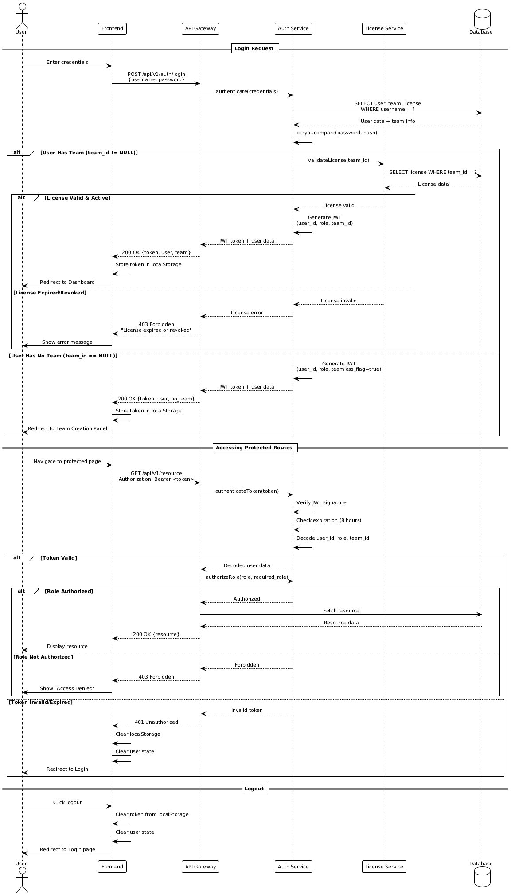
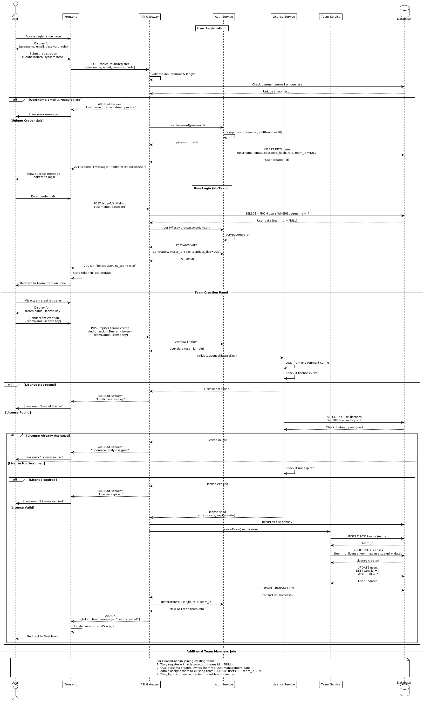

# Rikugan - Architecture and Design Document v1

## Table of Contents

1. [Introduction and Goals](#1-introduction-and-goals)
   - 1.1. [Requirements Overview](#11-requirements-overview)
   - 1.2. [Quality Goals](#12-quality-goals)
   - 1.3. [Stakeholders](#13-stakeholders)
2. [Architecture Constraints](#2-architecture-constraints)
   - 2.1. [Technical Constraints](#21-technical-constraints)
   - 2.2. [Organizational Constraints](#22-organizational-constraints)
   - 2.3. [Conventions](#23-conventions)
3. [System Scope and Context](#3-system-scope-and-context)
   - 3.1. [Business Context](#31-business-context)
   - 3.2. [Technical Context](#32-technical-context)
4. [Solution Strategy](#4-solution-strategy)
5. [Building Block View](#5-building-block-view)
   - 5.1. [Whitebox Rikugan System](#51-whitebox-rikugan-system)
   - 5.2. [Building Blocks - Level 2](#52-building-blocks---level-2)
6. [Runtime View](#6-runtime-view)
   - 6.1. [User Authentication Flow](#61-user-authentication-flow)
   - 6.2. [Task Assignment and Completion](#62-task-assignment-and-completion)
   - 6.3. [Notification System Flow](#63-notification-system-flow)
   - 6.4. [License Validation and Team Access Control](#64-license-validation-and-team-access-control)
7. [Deployment View](#7-deployment-view)
8. [Concepts](#8-concepts)
   - 8.1. [Domain Models](#81-domain-models)
   - 8.2. [Persistency](#82-persistency)
   - 8.3. [User Interface](#83-user-interface)
   - 8.4. [Security](#84-security)
   - 8.5. [Session Handling](#85-session-handling)
   - 8.6. [Error Handling](#86-error-handling)
   - 8.7. [Logging and Monitoring](#87-logging-and-monitoring)
   - 8.8. [Configuration](#88-configuration)
9. [Design Decisions](#9-design-decisions)
   - 9.1. [Technology Stack Selection](#91-technology-stack-selection)
   - 9.2. [Database Design](#92-database-design)
   - 9.3. [Authentication Strategy](#93-authentication-strategy)
10. [Quality Scenarios](#10-quality-scenarios)
11. [Technical Risks](#11-technical-risks)
12. [Glossary](#12-glossary)


## 1. Introduction and Goals

Rikugan is a gamified project management web application combining Kanban functionality with bounty-based task rewards for software development teams.

### 1.1. Requirements Overview

**Core Features:**
- Role-based management: Goons (task workers), Hashira (task creators), Oyakatasama (admins)
- Bounty system with monetary task rewards and deadline penalties
- Kanban board interface with drag-and-drop
- Real-time notifications and license-based access control

### 1.2. Quality Goals

| Priority | Goal | Target |
|----------|------|--------|
| 1 | Usability | Intuitive interface, <10min learning curve |
| 2 | Security | JWT auth, RBAC, data protection |
| 3 | Performance | <500ms API response, 50 concurrent users |
| 4 | Maintainability | Modular architecture, 70% test coverage |
| 5 | Scalability | Support 200 users, 1000 tasks |

## 2. Architecture Constraints

**Technical:** React 18+, Node.js, MySQL 8.0+, Docker, web-based access  
**Organizational:** 3-4 student developers, one semester timeline, Git version control, 70% test coverage  
**Conventions:** RESTful API, arc42 docs, ESLint standards, snake_case (DB), camelCase (code), PascalCase (components)

## 3. System Scope and Context

**Users:**  
- **Goons**: Browse/complete tasks, earn bounties  
- **Hashira**: Create tasks, manage teams, all Goon functions  
- **Oyakatasama**: Full system admin, user/license management

**Technical Components:**  
- **Frontend**: React 18+ with HeroUI (browser-based UI)  
- **Backend**: Node.js/Express.js (RESTful API, auth, business logic)  
- **Database**: MySQL 8.0+ (users, tasks, bounties, notifications, licenses)  
- **Deployment**: Docker containerization


## 4. Solution Strategy

**Architecture:** Role-based hierarchy (Goons → Hashira → Oyakatasama) + bounty incentive system  
**Stack:** React 18+ (HeroUI), Node.js/Express.js (MVC), MySQL (normalized schema), Docker  
**Security:** JWT authentication, RBAC at API/component levels  
**Key Decisions:** Bounty-first design, license-controlled access, API-first development, audit trails

## 5. Building Block View

### 5.1. System Architecture


**Client Layer:** React UI with HeroUI components, state management  
**API Gateway:** Express.js server, JWT auth, routing, validation  
**Database:** MySQL with normalized schema, connection pooling

### 5.2. Use Case View


### 5.3. Backend MVC Architecture


**Model:** Data entities, business logic, database interactions  
**Controller:** HTTP request handling, route management  
**View:** JSON response formatting

### 5.4. Domain Model


### 5.5. Backend Modules

| Module | Responsibilities |
|--------|------------------|
| **auth** | JWT authentication, login/logout, token management |
| **users** | User CRUD, profiles, team membership, earnings |
| **tasks** | Task lifecycle, assignment, status tracking, Kanban |
| **bounties** | Payment processing, balance management, penalties |
| **notifications** | Event notifications, delivery, preferences |
| **licenses** | License validation, team access control |
| **teams** | Team management, member ops, statistics |

## 6. Runtime View

### 6.1. User Authentication Flow



### 6.2. User Registration and Team Creation Flow



### 6.3. Task Assignment and Completion Flow


### 6.4. Notification System Flow


### 6.5. License Validation Flow


## 7. Deployment View


**Components:**  
- **Frontend Container**: React 18+/Vite/nginx (production build)  
- **Backend Container**: Node.js 18+/Express.js (API server)  
- **Database Container**: MySQL 8.0+ (persistent storage)  
- **Reverse Proxy**: nginx (load balancing, SSL)  

**Requirements:** Docker 20.10+, Docker Compose 2.0+, 4GB RAM, 20GB disk

## 8. Concepts

### 8.1. Domain Models

**Core Entities:**
- **Team**: id, name, isActive, createdBy | One-to-many with Users, one-to-one with License
- **User**: id, username, email, password, role (GOON/HASHIRA/OYAKATASAMA), teamId, balance | Many-to-one with Team
- **Task**: id, title, description, status, priority, bountyAmount, deadline, createdBy, assignedTo | Status: AVAILABLE → IN_PROGRESS → REVIEW → COMPLETED
- **License**: id, teamId (unique), licenseKey (unique), isActive, expirationDate, maxUsers | One-to-one with Team
- **Notification**: id, userId, type, message, readStatus, relatedTaskId | One-to-many with User
- **Transaction**: id, userId, taskId, type (BOUNTY/PENALTY/ADJUSTMENT), amount, balanceBefore, balanceAfter | Immutable

**Key Constraints:**
- Unique usernames/emails, one license per team, bounty ≥ 0, one user per task, passwords bcrypt-hashed

### 8.2. Persistency

**MySQL 8.0+** with normalized schema. Core tables: `teams`, `users` (teamId FK), `tasks` (teamId, createdBy, assignedTo FKs), `licenses` (teamId unique FK), `notifications`, `transactions`. Connection pooling, prepared statements, indexed on user_id/task_status/deadlines, automated backups.

### 8.3. User Interface

React 18+ with HeroUI components, responsive (mobile-first), role-based UI rendering, WCAG 2.1 Level A, lazy loading, dark/light mode.

### 8.4. Security

JWT auth (8hr expiration), bcrypt passwords, RBAC (API + component level), input validation/sanitization, SQL injection prevention, XSS protection, HTTPS enforcement, Helmet security headers.

### 8.5. Session Handling

Stateless JWT tokens with user ID, role, permissions. 8hr expiration, refresh token mechanism, auto-logout.

### 8.6. Error Handling

React error boundaries, global API error handler, structured error responses with codes (VALIDATION_ERROR, INTERNAL_ERROR), user-friendly messages.

### 8.7. Logging and Monitoring

Structured JSON logs (timestamp, level, service, userId, action), different log levels per environment, request/response logging, security audit trails.

### 8.8. Configuration

Environment-based config (server port/host, database connection, JWT secrets, bounty rules), separate dev/prod settings via environment variables.

## 9. Design Decisions

**Technology Stack:** React/Node.js/MySQL chosen for full JavaScript stack, excellent documentation, learning value, and rapid development.

**Database:** 3NF with strategic denormalization for performance. Foreign key constraints ensure integrity, separate bounties/transactions table for audit trail.

**Authentication:** JWT-based (stateless, scalable, mobile-ready, role/permissions in token). 8hr expiration, refresh tokens for UX.

## 10. Quality Scenarios

### 10.1. Quality Tree

## 10. Quality Scenarios

### 10.1. Quality Tree

```
Rikugan Quality Goals
├── Usability
│   ├── Learning Curve (High Priority)
│   │   └── New users can complete basic tasks within 10 minutes
│   └── Interface Consistency (Medium Priority)
│       └── All pages follow consistent navigation patterns
├── Performance  
│   ├── Response Time (High Priority)
│   │   └── API calls respond within 500ms for 95% of requests
│   └── Concurrent Users (Medium Priority)
│       └── Support 50 simultaneous users without degradation
├── Security
│   ├── Authentication (High Priority)
│   │   └── Secure login with role-based access control
│   └── Data Protection (High Priority)
│       └── All user data encrypted and validated
└── Maintainability
    ├── Code Quality (Medium Priority)
    │   └── 70% test coverage with clean architecture
    └── Documentation (Medium Priority)
        └── Complete API and component documentation
```

### 10.2. Evaluation Scenarios

**Usability - New User Onboarding**
*Scenario*: A new Goon user logs in for the first time and wants to select and complete their first task.
*Measurement*: Time from login to task selection should be under 5 minutes without training.
*Architecture Support*: Clear dashboard design with visual task cards and intuitive status progression.

**Performance - Concurrent Task Updates**
*Scenario*: 20 users simultaneously update task statuses during peak usage.
*Measurement*: All updates complete within 2 seconds with no data conflicts.
*Architecture Support*: Database connection pooling and optimistic locking prevent performance bottlenecks.

**Security - Role Privilege Escalation**
*Scenario*: A Goon user attempts to access Hashira-only functions through direct API calls.
*Measurement*: All unauthorized attempts are blocked and logged.
*Architecture Support*: Multi-layer authorization checks at API middleware and service levels.

**Maintainability - Feature Addition**
*Scenario*: Adding a new task filter feature requires changes across frontend and backend.
*Measurement*: Implementation completed in under 4 hours by a new team member.
*Architecture Support*: Modular component structure and clear API patterns enable quick feature addition.

---

## 11. Technical Risks

| Risk | Probability | Impact | Mitigation Strategy |
|------|-------------|--------|-------------------|
| **Database Performance Degradation** | Medium | High | Implement query optimization, indexing, and connection pooling. Monitor query performance in development. |
| **JWT Token Security Vulnerabilities** | Low | High | Use strong secrets, implement proper token expiration, and regular security audits. |
| **React Component State Management Complexity** | High | Medium | Use established patterns (Context API, custom hooks) and maintain clear data flow. |
| **API Rate Limiting Bypass** | Medium | Medium | Implement multiple layers of rate limiting and input validation. |
| **Database Schema Changes Breaking Compatibility** | Medium | High | Use database migration scripts and maintain backward compatibility during transitions. |
| **Third-party Library Vulnerabilities** | Medium | Medium | Regular dependency updates, security scanning, and minimal external dependencies. |


**Risk Monitoring:**
```
- Weekly security scans of dependencies
- Performance monitoring in development environment
- Code review process for all changes
- Automated testing to catch regression issues
│   │   └── API calls respond within 500ms for 95% of requests
│   └── Concurrent Users (Medium Priority)
│       └── Support 50 simultaneous users without degradation
├── Security
│   ├── Authentication (High Priority)
│   │   └── Secure login with role-based access control
│   └── Data Protection (High Priority)
│       └── All user data encrypted and validated
└── Maintainability
    ├── Code Quality (Medium Priority)
    │   └── 70% test coverage with clean architecture
    └── Documentation (Medium Priority)
        └── Complete API and component documentation
```
### 10.2. Evaluation Scenarios

**Usability - New User Onboarding**
*Scenario*: A new Goon user logs in for the first time and wants to select and complete their first task.
*Measurement*: Time from login to task selection should be under 5 minutes without training.
*Architecture Support*: Clear dashboard design with visual task cards and intuitive status progression.

**Performance - Concurrent Task Updates**
*Scenario*: 20 users simultaneously update task statuses during peak usage.
*Measurement*: All updates complete within 2 seconds with no data conflicts.
*Architecture Support*: Database connection pooling and optimistic locking prevent performance bottlenecks.

**Security - Role Privilege Escalation**
*Scenario*: A Goon user attempts to access Hashira-only functions through direct API calls.
*Measurement*: All unauthorized attempts are blocked and logged.
*Architecture Support*: Multi-layer authorization checks at API middleware and service levels.

**Maintainability - Feature Addition**
*Scenario*: Adding a new task filter feature requires changes across frontend and backend.
*Measurement*: Implementation completed in under 4 hours by a new team member.
*Architecture Support*: Modular component structure and clear API patterns enable quick feature addition.

---

## 11. Technical Risks

| Risk | Probability | Impact | Mitigation Strategy |
|------|-------------|--------|-------------------|
| **Database Performance Degradation** | Medium | High | Implement query optimization, indexing, and connection pooling. Monitor query performance in development. |
| **JWT Token Security Vulnerabilities** | Low | High | Use strong secrets, implement proper token expiration, and regular security audits. |
| **React Component State Management Complexity** | High | Medium | Use established patterns (Context API, custom hooks) and maintain clear data flow. |
| **API Rate Limiting Bypass** | Medium | Medium | Implement multiple layers of rate limiting and input validation. |
| **Database Schema Changes Breaking Compatibility** | Medium | High | Use database migration scripts and maintain backward compatibility during transitions. |
| **Third-party Library Vulnerabilities** | Medium | Medium | Regular dependency updates, security scanning, and minimal external dependencies. |

**Risk Monitoring:**
- Weekly security scans of dependencies
- Performance monitoring in development environment
- Code review process for all changes
- Automated testing to catch regression issues

---

## 12. Glossary

**Bounty**: Monetary task reward | **Goon**: Junior programmer role | **Hashira**: Senior programmer role | **Oyakatasama**: Administrator role | **JWT**: JSON Web Token authentication | **Kanban**: Visual project management | **RBAC**: Role-Based Access Control | **REST**: Representational State Transfer API | **Docker**: Containerization platform | **Express.js**: Node.js web framework | **HeroUI**: React component library | **MySQL**: Relational database | **Vite**: Build tool | **WCAG**: Web accessibility standards | **XSS**: Cross-Site Scripting attack

---

**Document:** Architecture design per arc42 template | **Version:** 1.0 | **Updated:** December 2024